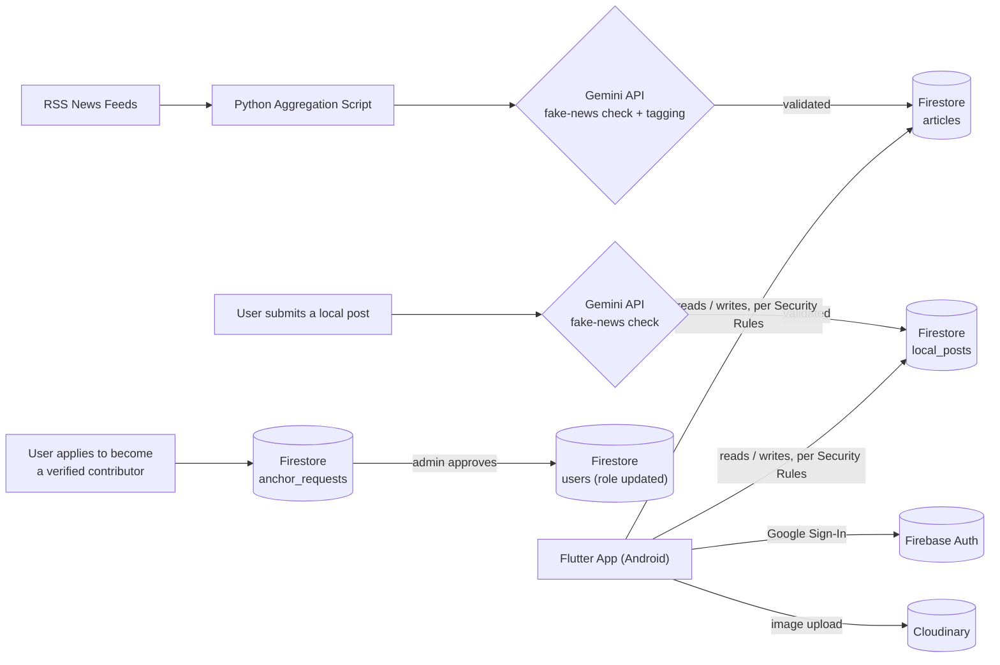

# 📰 Hyper-Local News Aggregation & Validation System

A mobile news platform that blends **AI-verified aggregated news** with **community-driven hyperlocal reporting** — built to fight misinformation at the neighborhood level, not just at the national-headline level.

Most news apps show you what's trending nationally. This app is built around the idea that the news that actually affects your daily life — a road closure, a local event, a water-supply issue — rarely makes it to big news outlets, and when regular people *do* try to share it, there's no way to tell what's true. This project tries to solve both problems at once: it aggregates real local news automatically, lets verified local contributors post updates directly, and runs **every single piece of content — machine-sourced or human-submitted — through an AI fact-check layer** before it ever reaches a reader's feed.

---

## ✨ Key Features

- **Dual-source hyperlocal feed** — a continuously aggregated feed pulled from local RSS news sources, *plus* an Instagram-style feed of posts from verified local contributors.
- **AI-powered misinformation filter** — every scraped article *and* every user-submitted post is screened by Google's Gemini AI for authenticity before it is published, rather than trusting the source blindly.
- **Smart content tagging** — articles are automatically classified by topic (`topicTags`) and by emotional tone (`emotionalTag`), enabling smarter, more relevant feed sorting instead of a single flat reverse-chronological list.
- **Community trust signal** — a `trueVotes` field lets the community itself weigh in on an article's credibility, layering crowd-sourced verification on top of the AI check.
- **Role-based publishing** — not everyone can post. Users must apply to become a verified local contributor ("Anchor"); an admin reviews the request before posting rights are granted, which keeps the local feed from being flooded by spam or bot accounts.
- **Google Sign-In authentication** via Firebase Auth.
- **Location-aware content** so users see news relevant to their own area.

---

## 🏗️ Architecture & Data Flow



The app is deliberately **serverless**: there is no custom backend server handling API requests. The Flutter app talks directly to Firebase using the official SDKs, and Firestore Security Rules act as the authorization layer that would normally live in a backend API.

---

## 🧰 Tech Stack

| Layer | Technology | Why |
|---|---|---|
| Mobile app | Flutter (Dart), Provider | Single codebase for Android, simple/predictable state management |
| Database | Cloud Firestore (NoSQL, real-time) | Real-time listeners push new articles/posts straight to the UI with no polling; flexible schema suits fast-changing content types |
| Auth | Firebase Authentication (Google Sign-In) | Zero password-storage liability, fast sign-up flow |
| Authorization | Firestore Security Rules | Enforces admin / verified-contributor / normal-user permissions at the database layer |
| Media storage | Cloudinary | Firebase Storage requires the paid "Blaze" billing plan; Cloudinary's free tier covers image hosting without needing a billing account |
| Content aggregation | Python + RSS feeds | Pulls raw local news content on a schedule |
| Content intelligence | Google Gemini API (`google_generative_ai`) | Fake-news/misinformation screening, topic tagging, emotional-tone tagging |
| Sharing / linking | `share_plus`, `url_launcher` | Native share sheet, opening source articles in-browser |

---

## 🗄️ Firestore Data Model

| Collection | Purpose | Notable fields |
|---|---|---|
| `articles` | AI-aggregated news, sourced from RSS feeds via the Python pipeline | `topicTags` (array), `emotionalTag`, `likeCount`, `trueVotes`, `publishedAt` |
| `local_posts` | User-submitted hyperlocal posts (Instagram-style) | `location`, `anchorId`, `likeCount`, `publishedAt` |
| `anchor_requests` | Pending applications from users who want posting rights | reviewed by an admin before approval |
| `users` | User profile + role (`admin` / `anchor` / normal user) | — |
| `locations` | Canonical list of localities used to tag and filter content | — |
| `tags` | Canonical list of topics used to populate `topicTags` | — |
| `dev_stories` | A separate curated content bucket | *(fill in a one-line description here if this is used for something specific)* |

**Composite indexes:** Firestore only auto-indexes single fields. Because the feed supports compound queries — e.g. *"articles with this topic, sorted by like count"* or *"articles with this emotional tone, sorted by recency"* — several composite indexes were manually defined on `topicTags`, `emotionalTag`, `likeCount`, `trueVotes`, and `publishedAt` to keep those queries fast.

---

## 🔐 Auth & Authorization Model

- Sign-in is handled by **Firebase Authentication** using **Google Sign-In**.
- Every user has a **role**: `admin`, verified contributor (**Anchor**), or plain user.
- Only `admin` accounts can approve entries in `anchor_requests`.
- Only users promoted to **Anchor** can write to `local_posts` — this is enforced in **Firestore Security Rules**, not just in the app's UI, so the restriction can't be bypassed by calling Firestore directly.
- This gate exists specifically to prevent spam/bot accounts from flooding the local feed with unverified or malicious content.

---

## ⚙️ Getting Started

1. **Install Flutter** (stable channel) and the Android toolchain.
2. **Clone the repo** and fetch dependencies:
   ```bash
   git clone https://github.com/Shashank-gowda-U/news_app.git
   cd news_app
   flutter pub get
   ```
3. **Create a Firebase project** at [console.firebase.google.com](https://console.firebase.google.com), then enable:
   - **Firestore Database**
   - **Authentication → Google Sign-In**
4. Download the generated `google-services.json` and place it in `android/app/`.
5. **Add your API keys** for Gemini and Cloudinary (do **not** hardcode/commit real keys — use `--dart-define` flags or a local, git-ignored config file).
6. Run the app:
   ```bash
   flutter run
   ```

> **Note:** The RSS + Gemini content-aggregation script that populates the `articles` collection is a separate utility, run independently of the Flutter app (see *Known Limitations* below) — cloning this repo alone gets you the app shell, not a pre-filled feed, unless your Firestore project already has seed data.

---

## ⚠️ Known Limitations & Lessons Learned

This project was built and hosted entirely on **Firebase's free "Spark" plan**, and a couple of real-world constraints shaped the final architecture:

- **Image storage:** Firebase Cloud Storage can only be used once a project is upgraded to the pay-as-you-go **"Blaze" plan**, which requires attaching a billing account. Since that wasn't an option, image uploads were routed to **Cloudinary's free tier** instead — a practical example of designing around a real budget constraint rather than around what's technically "cleanest."
- **Content aggregation isn't fully automated in production:** ideally the RSS/Gemini scraper would run on a schedule (e.g. a cron job or a scheduled cloud function), but hosting anything that runs unattended 24/7 has a cost, so it was run on-demand instead.
- **Not built for scale as-is:** the free Firestore tier has daily read/write quotas; scaling this to real, continuous public usage would require moving to Firebase's paid tier or optimizing read patterns (e.g. pagination, caching) further.

---

## 📄 License

Built as a 5th sem minor engineering project. Add a license here if you intend to open-source it further.
